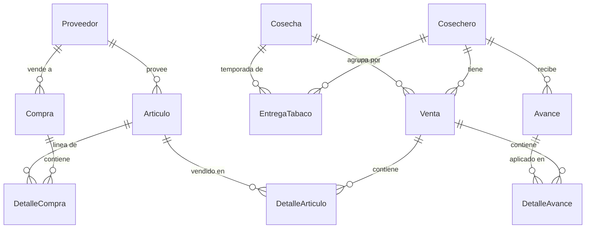

# Arquitectura — Tabacalera

> Actualizado: 2026-08-08, rama `feature/venta-segura`. Las rutas `archivo:línea` antiguas pueden haberse desplazado durante la implementación.

## 1. Qué es este sistema

Tabacalera es un software de uso interno desarrollado dentro de **Tabacalera Genao**, una empresa familiar dedicada al cultivo de tabaco, al financiamiento de cosechas, a la compra del tabaco producido y a la venta/suministro de insumos. Su objetivo principal es dar control operativo y financiero a la empresa; no es un producto SaaS ni un sistema pensado actualmente para terceros. **Corre localmente** en las instalaciones de la empresa.

### 1.1 Relación con los cosecheros

La empresa financia a los productores ("cosecheros") durante el ciclo agrícola. Les entrega dinero por adelantado y también les suministra productos e insumos necesarios para trabajar la cosecha. A cambio, existe un contrato mediante el cual el cosechero se compromete a vender a Tabacalera Genao la totalidad del tabaco producido.

Por tanto, en este sistema una **venta al cosechero** no debe interpretarse solamente como una venta comercial ordinaria. Es también un cargo dentro de la cuenta de financiamiento de su cosecha. Tanto los artículos entregados como los avances de dinero forman parte del monto acumulado que posteriormente debe conciliarse con el valor del tabaco entregado por ese cosechero.

Esa conciliación **no se almacena en un modelo separado de libro mayor**. Se reconstruye cuando se genera el reporte de un cosechero para una cosecha seleccionada. El reporte consulta todos los movimientos vinculados a esa combinación `cosechero + cosecha` y calcula:

- **Gastos/cargos:** valor de los artículos suministrados + avances de dinero.
- **Producción/ingresos:** valor del tabaco entregado, calculado por variedad, clasificación, cantidad, tara y precio — el precio se busca en `PrecioVariedadCosecha` (por variedad **y cosecha**, con historial), ya no está hardcodeado (ver §4.1).
- **Resultado o saldo:** `total de gastos - total de producción`.

El PDF resultante contiene el detalle de artículos, avances y entregas, el resumen financiero y los espacios para la firma del cosechero y del representante de Tabacalera Genao. En términos funcionales, este reporte calculado cumple actualmente el papel de estado de cuenta o libro auxiliar de la cosecha, aunque el saldo no quede persistido como una transacción independiente.

### 1.2 Ciclo operativo semanal

Durante la semana un cosechero puede:

- retirar uno o varios productos o insumos;
- recibir un avance extraordinario de dinero en cualquier día, fuera de la fecha habitual;
- acumular varios movimientos antes del cierre semanal.

Los sábados los cosecheros pasan por la empresa para revisar y firmar la documentación correspondiente a los movimientos de la semana. Esta operación explica la lógica de `Venta`: los movimientos registrados entre lunes y sábado se asignan al sábado próximo y se consolidan en un solo ticket/cuenta semanal por cosechero. Si durante la misma semana se vuelve a guardar un movimiento para ese cosechero, el sistema reutiliza la venta semanal existente y agrega los nuevos cargos, en lugar de crear una factura independiente.

La regla quedó confirmada: **Guardar** acumula sin imprimir y el cierre del sábado es informativo, no inmutable. **Registrar e imprimir** guarda primero y luego imprime el ticket semanal completo. Todo movimiento posterior vuelve a marcar el ticket como pendiente de impresión.

Cada envío nuevo queda auditado en `OperacionVenta`, con UUID idempotente, usuario, fecha real del movimiento, fecha/hora de registro, hash del payload, importe agregado y solicitud de impresión. Los detalles históricos conservan `operacion=NULL`.

## Estado técnico vigente de la interfaz

- Ventas usa AJAX, errores inline, borrador por pestaña/usuario con expiración de 24 horas y resumen semanal previo al envío.
- Tickets filtra y pagina 50 filas en servidor; la impresión solo acepta POST.
- Cosecheros, artículos y proveedores cuentan con CRUD operativo Tailwind y desactivación lógica.
- Dashboard calcula los dos lados de la conciliación por cosecha y exporta CSV sin persistir otro saldo.
- `proximo_sabado()` vive en `app/business_dates.py`.
- Configuración sensible y rutas locales se leen desde `.env`; el repositorio solo conserva `.env.example`.
- Tailwind y Alpine son locales; no hay dependencia de fuentes web y existe favicon local.

### 1.3 Flujo funcional reflejado en el código

El flujo implementado actualmente es:

1. Se compran insumos agrícolas (`Articulo`: abonos, fungicidas, insecticidas, herbicidas, herramientas) a un **proveedor**, generando inventario por lotes (FIFO).
2. Un **cosechero** (productor/agricultor) entrega tabaco por temporada (**cosecha**), clasificado por variedad y grado de hoja.
3. Al cosechero también se le pagan **avances** — cheque, depósito o efectivo — a cuenta de lo que va a vender.
4. Semanalmente (con cierre automático los sábados) se genera una **venta** por cosechero que consolida: artículos vendidos (descontados del inventario FIFO) + avances aplicados. Esa venta es, en la práctica, la "factura"/ticket que se imprime.

## 2. Stack técnico

- **Backend**: Django 4.1, Python. Vistas "delgadas" que delegan a `services.py` por app (patrón ya establecido en `ventas` y `avance` — seguirlo al tocar otras apps).
- **Base de datos**: MSSQL vía `django-mssql-backend` (`app/settings.py:87-98`), ODBC Driver 17, Windows Trusted Connection, host `DESKTOP-VGQEGRL`. Hay un `db.sqlite3` de 0 bytes en la raíz — residual, no se usa.
- **Estáticos**: WhiteNoise (`CompressedManifestStaticFilesStorage`) — no hay servidor web aparte sirviendo estáticos.
- **Frontend**: Tailwind CSS 3 + Alpine.js 3, sin framework de estado global — cada página tiene su propio componente `x-data`. **No** se usa `django-tailwind`; es un pipeline npm manual:
  - `static_src/css/input.css` → fuente Tailwind (`@tailwind base/components/utilities` + capas custom).
  - `npm run dev` (watch) / `npm run build` (minificado) → compila a `static/css/tailwind.css`, que es el único CSS que carga `base.html`.
  - `npm run copy-alpine` copia Alpine desde `node_modules` a `static/js/alpine.min.js` (servido local, no CDN).
  - `npm run setup` corre todo lo anterior de una — usar esto en un clon nuevo del repo.
  - `tailwind.config.js`: escanea `./*/templates/**/*.html` + `./app/templates/**/*.html`; paleta custom `tobacco` (marrón/naranja); fuentes DM Sans (display/body) + JetBrains Mono; plugin `@tailwindcss/forms`. **No hay `dark:` variant configurado** — el tema oscuro está hardcodeado con clases `bg-slate-900/950`, no hay modo claro.
- **Impresión**: tickets se imprimen en una impresora térmica USB vía `escpos.printer.Usb`, de forma síncrona dentro del request (ver Plan de Mejora, Fase 1).
- **Reportes**: PDFs de cosechero generados con ReportLab (`cosecheros/views.py` arma el documento; toda la lógica de cálculo —tara, precios, saldos— vive en `cosecheros/services.py`, única fuente de verdad; `cosecheros/utils/reportes.py` ya no existe, se consolidó ahí).

## 3. Mapa de apps

| App | Rol | Rutas (`app/urls.py`) | Estado de migración Tailwind |
|---|---|---|---|
| `dashboard` | Landing/home. `models.py` vacío. | `/` | N/A (solo usa `base.html`) |
| `cosecheros` | Productores, temporadas de cosecha, entregas de tabaco por grado, precios por variedad/cosecha. PDFs de resumen por cosechero. | `/cosecheros/` | ✅ Migrado |
| `avance` | Avances/cheques a cosecheros — hoy solo vía **import masivo** CSV/XLSX. | `/avances/` | ✅ Migrado |
| `proveedor` | Registro de proveedores. | — (sin `urls.py`) | N/A (sin templates/views reales) |
| `articulo` | Catálogo de insumos agrícolas, ligados a un proveedor. | — (sin `urls.py`) | N/A (sin templates/views reales) |
| `compra` | Compras de artículos a proveedores; inventario FIFO por lote (`DetalleCompra.cantidad_restante`). | `/compra/` | ✅ Migrado |
| `ventas` | App central: registro de ventas/tickets semanales (artículos + avances), listado de tickets, impresión. | `/ventas/` | ✅ Migrado |

`proveedor` y `articulo` no tienen ni `urls.py` ni vistas reales (`views.py` son stubs) — hoy solo existen como modelos consumidos por `compra`. Esto es una decisión a confirmar con el usuario en la Fase 2 del plan de mejora: ¿se quedan solo-admin o necesitan UI propia?

## 4. Modelos y relaciones

Notas importantes que no son obvias del diagrama:

- **`Venta` es el nodo central** que conecta cosechero + cosecha + artículos vendidos + avances aplicados. En la práctica es "el ticket/factura".
- **`DetalleArticulo` no es 1 fila = 1 línea de carrito.** Es 1 fila por **lote FIFO consumido** (`ventas/services.py:consumir_lotes_fifo`). Si el inventario de un artículo está repartido en 3 compras distintas, un solo ítem del carrito puede generar 3 `DetalleArticulo`.
- **`Avance` es un modelo unificado** (`tipo_avance`: cheque/depósito/efectivo) — antes eran 3 modelos separados (`Cheque`, `Depósito`, `PagoEfectivo`), colapsados en la migración `avance/migrations/0002_avance_remove_deposito_cosechero_and_more.py`. Código viejo que aún referencie esos 3 modelos está roto (ver §6).
- **`cosecheros.views` importa de `ventas`** para generar los reportes PDF de cosechero (necesita `Venta`/`DetalleArticulo`/`DetalleAvance`) — es un acoplamiento en sentido inverso al de los FKs (ventas depende de cosecheros vía FK, pero cosecheros depende de ventas para reportes). Tenerlo presente si se reorganiza alguna de las dos apps.
- **Soft-delete generalizado**: casi todos los modelos (`Cosechero`, `Articulo`, `Compra`, `DetalleCompra`, `Avance`, `Venta`, `Proveedor`) sobreescriben `delete()` para poner `is_active=False` en vez de borrar. Como esto **no** pasa por el `Collector` de Django, las señales `pre_delete`/`post_delete` no se disparan en un borrado individual — pero sí se disparan en un borrado masivo por queryset (`Model.objects.filter(...).delete()`), por ejemplo desde una acción bulk del admin.

### 4.1 Precios de tabaco por variedad y cosecha

`PrecioVariedadCosecha` (`cosecheros/models.py`) fija, para una `Cosecha` y una `EntregaTabaco.VARIEDADES_CHOICES` dadas, el precio de cada una de las 7 clasificaciones de hoja (centro largo, centro corto, uno y medio, libre pie, picadura, rezago, criollo). `unique_together = ('cosecha', 'variedad')` — formato **ancho**: una fila por variedad, 7 columnas de precio, en vez de una fila por clasificación.

Antes estos precios eran un diccionario (`PRECIOS_VARIEDAD`) **hardcodeado y duplicado** en `cosecheros/views.py` y `cosecheros/utils/reportes.py`, emparejado *por posición* con la lista de clasificaciones (frágil) y sin variar por cosecha. Ahora:

- **Única fuente de cálculo**: `cosecheros/services.py` — `CLASIFICACIONES` (tabla que reemplaza el emparejamiento posicional), `aplicar_tara()`, `obtener_precios(cosecha)`, `calcular_produccion_entrega()`, `calcular_produccion_total()`, `calcular_gastos()`, `calcular_saldos_cosecha()`, `clonar_precios()`. Tanto el PDF (`cosecheros/views.py`) como el comando `resumen_perdidas_cosecha` consumen estas mismas funciones — ya no hay dos implementaciones que puedan divergir.
- **Historial por temporada**: cambiar el precio de una cosecha no afecta los reportes de cosechas anteriores (cada una tiene sus propias filas `PrecioVariedadCosecha`).
- **Copia automática al abrir cosecha nueva**: señal `post_save` sobre `Cosecha` en `cosecheros/signals.py` clona los precios de la cosecha más reciente que ya tenga precios cargados (`clonar_precios`), para no recapturar 42 valores cada temporada. También hay un botón "Clonar precios de…" en la página de gestión para hacerlo a demanda.
- **Gestión**: página Tailwind `cosecheros/templates/precios.html` (`/cosecheros/precios/`, nombre de URL `precios`) — selector de cosecha, grilla de 6 variedades × 7 precios, guardar y clonar. También registrado en el admin (`PrecioVariedadCosecha`, con `list_filter`/`list_editable`) como respaldo para edición masiva.
- **Precio faltante**: si una variedad no tiene precio cargado para la cosecha, el PDF lo señala explícitamente en vez de fallar (`KeyError` antes de este cambio).

## 5. Los dos caminos para crear un "cheque" (`Avance`)

Esto no es obvio navegando el sidebar, así que vale la pena documentarlo explícitamente:

| Camino | Dónde | Para qué sirve |
|---|---|---|
| **A. Import masivo** | `avance/` → `/avances/` (`upload.html`, wizard de 3 pasos: subir → previsualizar/corregir → confirmar) | Cargar muchos avances de una vez desde un export bancario (CSV/XLSX de cheques, depósitos o pagos en efectivo) |
| **B. Entrada individual** | Dentro de `ventas/templates/ventas_form.html`, modal "Nuevo Avance" | El flujo diario: mientras se registra una venta a un cosechero, se agrega un cheque/depósito/efectivo puntual como parte de esa misma venta |

**La app `avance` en sí no tiene ninguna vista para crear/editar/listar un `Avance` individual** — solo el wizard de import masivo. Lo que el usuario probablemente tiene en mente cuando dice "la creación de cheques es lenta" es el camino B (el modal dentro de `ventas_form.html`), que comparte toda la infraestructura (y por lo tanto los mismos problemas de rendimiento) del registro de ventas — ver `PLAN_MEJORA.md`.

## 6. Deuda técnica y roturas conocidas

Registradas aquí para que no se vuelvan a introducir ni se pierda el rastro de por qué existen. El detalle de cómo arreglarlas está en `PLAN_MEJORA.md`.

**Resueltas** (dejadas acá como registro, no como pendientes): el bug de `cosecheros/signals.py` referenciando `Avance.Cheque/Deposito/PagoEfectivo` (modelos eliminados) — ahora usa el `Avance` unificado; `ventas/forms.py` (código muerto, borrado); `procesar_detalles_articulos` duplicada en `ventas/services.py` (deduplicada); `static/css/output.css` (borrado); la tabla `PRECIOS_VARIEDAD` duplicada entre `cosecheros/views.py` y `cosecheros/utils/reportes.py` (reemplazada por `PrecioVariedadCosecha` + `cosecheros/services.py`, ver §4.1); el filtro invertido de saldo en `resumen_perdidas_cosecha` (ahora muestra ambos grupos — nos deben / les debemos — en vez de filtrar por un signo).

**Aún abiertas:**

- **`proximo_sabado()`** duplicada, copy-paste idéntico entre `avance/services.py` y `ventas/services.py` — mismo docstring, misma lógica, dos lugares para desincronizarse.
- **`Cosechero.numero_cuenta_banco`** es `CharField(unique=True, blank=True)` — el clásico footgun de Django: si dos cosecheros se guardan con este campo vacío (`''` en vez de `None`), el segundo guardado revienta con `IntegrityError` en MSSQL.
- **Validador de cédula** (`cosecheros/models.py`) indexa el string (`cedula[0:3]`, etc.) sin verificar primero que sea numérico — puede romper con un input no numérico en vez de dar un mensaje de validación claro.
- **Login (resuelto 2026-08-08)**: `/accounts/login/` usa el sistema de autenticación de Django con una pantalla Tailwind propia. Dashboard y todas las pantallas operativas requieren sesión; logout regresa al login. `/admin/` conserva su acceso independiente para administración.
- **Configuración de desarrollo expuesta**: `DEBUG=True`, `SECRET_KEY` hardcodeada, `ALLOWED_HOSTS=['*', '192.168.43.90']` en `app/settings.py` — normal para desarrollo en LAN, pero hay que revisarlo antes de cualquier exposición fuera de la red local.
- **Dashboard/reportes dinámicos de saldos**: el usuario mencionó querer, a futuro, un dashboard o generador de reportes dinámico para ver de un vistazo cuánto se debe a cada cosechero y cuánto debe cada uno (hoy solo existe vía PDF individual o el comando `resumen_perdidas_cosecha` por línea de comandos). Anotado como evolución futura, fuera del alcance de los cambios de precios dinámicos.

## 7. Convenciones a seguir al escribir código nuevo

- **Vistas delgadas, lógica en `services.py`** — patrón ya establecido en `ventas` y `avance`, seguirlo en `cosecheros`/`compra` cuando se migren.
- **Soft-delete**: nunca usar `.delete()` directo esperando que borre; todos los modelos de dominio sobreescriben `delete()` para desactivar (`is_active=False`).
- **Alpine.js por página**, no hay estado global compartido entre templates — cada `` define su propio `x-data`.
- **Tema oscuro únicamente** — no hay soporte de modo claro ni variantes `dark:`; los componentes nuevos deben usar la paleta `slate-900/950` + acentos `tobacco-*` ya definida.
- **Clase `.tw`** (`static_src/css/input.css`) se mantiene como convención de scoping. Desde 2026-08-08, las cuatro apps con pantallas operativas (`ventas`, `avance`, `cosecheros`, `compra`) están migradas y ya no quedan clases Bootstrap en sus templates.
